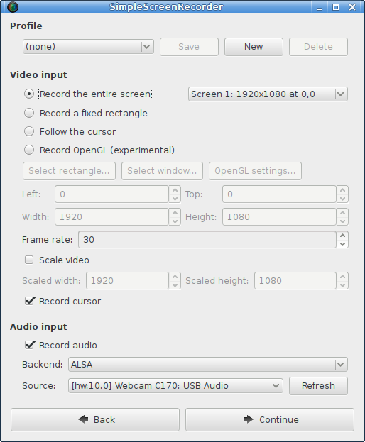

SimpleScreenRecorder
====================

SimpleScreenRecorder is a screen recorder for Linux. Despite the name, this program is actually quite complex. It's 'simple' in the sense that it's easier to use than ffmpeg/avconv or VLC :).

There is a separate repository for SimpleScreenRecorder packages:
https://github.com/MaartenBaert/ssr-packages

License
-------

GNU GPL v3 - read 'COPYING' for more info.

Compiling
---------

Important: If you have already installed SSR using the package manager of your distribution, you should uninstall it first before continuing!

First install the required dependencies (see below). After you have done that, you can compile and install SSR by running:

    ./simple-build-and-install

In order to use OpenGL recording for 32-bit applications on a 64-bit system, you need to compile a 32-bit version of `libssr-glinject.so`. The script will do this automatically if your system is 64-bit. Unfortunately some distributions (older versions of Debian, Ubuntu, Linux Mint, ...) don't properly support compiling 32-bit libraries on a 64-bit system, which results in errors related to missing libraries (usually libGL, libGLU) even when those libraries have in fact been installed. The problem is caused by the fact that the required symlinks are included in the `-dev` packages, but the 32-bit `-dev` packages can't be installed. The simplest solution is to skip compilation of the 32-bit GLInject library, which can be done by running:

    ENABLE_32BIT_GLINJECT=FALSE ./simple-build-and-install

You can then use SSR without the 32-bit library, or you can use the precompiled 32-bit library provided by your distribution.

If you actually want to compile the 32-bit library, you have to manually create the missing symlinks in the 32-bit library directory:

    cd /usr/lib/i386-linux-gnu
    sudo ln -s libGLU.so.1 libGLU.so
    sudo ldconfig

The OpenGL library `libGL.so` is a special case, because on some distributions (Ubuntu, Linux Mint, ...) it is installed in a different location depending on which driver you are using. If your distribution has installed the file `libGL.so.1` in the regular 32-bit library directory `/usr/lib/i386-linux-gnu` (e.g. Debian), then run this:

    cd /usr/lib/i386-linux-gnu
    sudo ln -s libGL.so.1 libGL.so
    sudo ldconfig

Otherwise you need to figure out where the library is installed first, and then manually create symlinks from the regular 32-bit library folder to this file. Note that doing this may interfere with OpenGL functionality if you ever switch to a different driver, or even just update the driver (in the case of NVIDIA). In that case you will need to manually remove the symlinks and (optionally) recreate them.

If you are using a combination of open-source and proprietary drivers (e.g. for laptops with Intel + NVIDIA GPUs a.k.a. 'Optimus'), follow only the steps for the open-source drivers.

If you are using one of the open-source drivers (i915, radeon, nouveau), then run this:

    cd /usr/lib/i386-linux-gnu
    sudo ln -s libGL.so.1 mesa/libGL.so
    sudo ln -s mesa/libGL.so libGL.so
    sudo ln -s mesa/libGL.so.1 libGL.so.1

If you are using the proprietary AMD driver, first figure out where the fglrx directory is located, this can be `/usr/lib32` or `/usr/lib/i386-linux-gnu`. Then go to the relevant folder and create the symlinks:

    cd /usr/lib/i386-linux-gnu
    sudo ln -s libGL.so.1 fglrx/libGL.so
    sudo ln -s fglrx/libGL.so libGL.so
    sudo ln -s fglrx/libGL.so.1 libGL.so.1

If you are using the proprietary NVIDIA driver, first figure out where the fglrx directory is located, this can be `/usr/lib32` or `/usr/lib/i386-linux-gnu`. Then go to the relevant folder and create the symlinks:

    cd /usr/lib/i386-linux-gnu
    sudo ln -s libGL.so.1 nvidia*/libGL.so
    sudo ln -s nvidia*/libGL.so libGL.so
    sudo ln -s nvidia*/libGL.so.1 libGL.so.1

Note that the full name of the 'nvidia' subdirectory includes the driver version number, so you will need to fix these symlinks whenever the driver has been updated.

If you want to compile step-by-step (without `simple-build-and-install`), you can use the following steps:

    mkdir build-release
    cd build-release
    cmake -DCMAKE_INSTALL_PREFIX="/usr" -DCMAKE_BUILD_TYPE=Release ..
    make
    sudo make install

Note that you may need to specify additional options depending on which Linux distribution and CPU architecture you have. The `simple-build-and-install` script detects the correct options automatically, you can run it to see which options you need.

You don't need to install the program to use it, but installing will give you a desktop entry and an icon. Also, if you don't install the program, you will need to specify where the GLInject libraries are located with `LD_LIBRARY_PATH` when using OpenGL recording.

Compilation issues
------------------

Most of these issues are avoided when using `simple-build-and-install`, but you may run into them if you run `cmake` directly.

### FFmpeg vs Libav confusion

Libav is a fork of FFmpeg that was created in 2011 as a result of a conflict between the developers. Some Linux distributions (including Debian and Ubuntu) switched to Libav because the package maintainers were among the Libav developers, while others stuck to FFmpeg. In order to deal with this situation, SSR supports both FFmpeg and Libav. In 2015 Debian and Ubuntu decided to switch back to FFmpeg for technical reasons, which means that these days very few SSR users are still using Libav. Although Libav is theoretically still supported by SSR, I am no longer doing any testing with it. As of 2020 Libav is effectively no longer being developed, so Libav support may be dropped entirely at some point in the future.

Since the FFmpeg and Libav APIs have changed significantly over time, SSR checks which version of the libraries is being used to determine which features are safe to use. Although the FFmpeg and Libav API are almost identical, there are some minor differences, mostly related to the version numbering scheme. Unfortunately SSR can not determine automatically whether you are using FFmpeg or Libav, so you have to specify this manually when running `cmake`, using the `ENABLE_FFMPEG_VERSIONS` option, which defaults to `TRUE` (i.e. FFmpeg). If you are using Libav, you should add the option `ENABLE_FFMPEG_VERSIONS=FALSE`. If you forget this, you will likely get various error messages during compilation related to missing functions, structures or fields.

You can check whether you are using FFmpeg or Libav by running the following command:

    grep "This file is part of" `pkg-config --variable=includedir libavcodec`/libavcodec/avcodec.h

This command should print either `This file is part of FFmpeg` or `This file is part of Libav`.

### Qt 4 MOC bug

When compiling with Qt 4 on some newer distributions, you may get the following error message from AutoMoc:

    [...]/ssr/src/Global.h:52: Parse error at "defined"

This is caused by a [Qt bug](https://bugreports.qt.io/browse/QTBUG-22829) which has been fixed in Qt 5, but has not been backported. The file path reported in the error message is wrong, the actual problem is triggered by line 52 in `/usr/include/sys/sysmacros.h`. To work around the bug, add the following option when running `cmake`:

    cmake [...] -DCMAKE_AUTOMOC_MOC_OPTIONS="-D_SYS_SYSMACROS_H_OUTER"

Alternatively, if your distribution provides Qt 5 packages, you can also use these instead. For Debian and Ubuntu, you would do this by installing `qt5-qmake`, `qtbase5-dev` and `libqt5x11extras5-dev`. The `simple-build-and-install` script will detect and use these automatically. If you run `cmake` yourself, you should add the option `-DWITH_QT5=TRUE` to use Qt 5 instead of Qt 4.

Build dependencies
------------------

You will need the following packages to compile SimpleScreenRecorder:

- GCC (>= 4.6)
- cmake
- pkg-config
- Qt4 (4.8 or newer) or Qt5 (5.7 or newer)
- ffmpeg or libav (libavformat, libavcodec, libavutil, libswscale)
- ALSA library
- PulseAudio library (optional, disable with -DWITH_PULSEAUDIO=FALSE)
- JACK library (optional, disable with -DWITH_JACK=FALSE)
- libGL (32 and 64 bit)
- libGLU (32 and 64 bit)
- libX11 (32 and 64 bit)
- libXfixes (32 and 64 bit)
- libXext
- libXi
- libxinerama
- video4linux2 (V4L2) library

If you have a 64-bit system and you want to compile the 32-bit GLInject library, you have to install some 32-bit libraries as well. Otherwise the regular packages are sufficient.

### Debian / Ubuntu

For newer versions (with Qt5):

    sudo apt-get install build-essential cmake pkg-config desktop-file-utils libgl1-mesa-dev libglu1-mesa-dev \
    qt5-qmake qttools5-dev qtbase5-dev libqt5x11extras5-dev libavformat-dev libavcodec-dev libavutil-dev \
    libswscale-dev libasound2-dev libpulse-dev libjack-dev libx11-dev libxext-dev libxfixes-dev libxi-dev \
    libxinerama-dev libv4l-dev

For older versions (with Qt4):

    sudo apt-get install build-essential cmake3 pkg-config desktop-file-utils libgl1-mesa-dev libglu1-mesa-dev \
    qt4-qmake libqt4-dev libavformat-dev libavcodec-dev libavutil-dev libswscale-dev libasound2-dev libpulse-dev \
    libjack-dev libx11-dev libxext-dev libxfixes-dev libxi-dev libxinerama-dev libv4l-dev

Extra dependencies for 32-bit GLInject on 64-bit systems:

    sudo dpkg --add-architecture i386
    sudo apt-get update
    sudo apt-get install g++-multilib libgl1-mesa-dev:i386 libglu1-mesa-dev:i386 libx11-dev:i386 libxfixes-dev:i386

Note: Debian <= 7 and Ubuntu <= 14.04 are affected by Debian bug #689088 (https://bugs.debian.org/cgi-bin/bugreport.cgi?bug=689088), which makes it impossible to install the 32-bit and 64-bit libGL/libGLU development packages at the same time. You should use the following command instead:

    sudo apt-get install g++-multilib libglu1-mesa:i386 libx11-dev:i386 libxfixes-dev:i386

Next you should apply the workarounds described in the 'compiling' section.

### OpenSUSE

This list is incomplete but usually sufficient:

    sudo zypper install gcc libffmpeg-devel libqt4-devel libpulse-devel libjack-devel \
    glu-devel libX11-devel libXext-devel libXfixes-devel libXi-devel

Some packages (e.g. ffmpeg) are not in the official repository, but can be installed from the [Packman repository](http://packman.links2linux.org/). You can add the Packman repository with this command:

    zypper addrepo -f http://ftp.gwdg.de/pub/linux/packman/suse/12.3/ packman

Extra dependencies for 32-bit GLInject on 64-bit systems:

    sudo zypper install gcc-32bit libstdc++47-devel-32bit glu-devel-32bit libX11-devel-32bit libXext-devel-32bit libXfixes-devel-32bit

### Fedora

    sudo yum install qt4 qt4-devel ffmpeg-devel alsa-lib-devel pulseaudio-libs-devel jack-audio-connection-kit-devel \
    make gcc gcc-c++ mesa-libGL-devel mesa-libGLU-devel libX11-devel libXext-devel libXfixes-devel

Some packages (e.g. ffmpeg) are not in the official repository, but can be installed from the [RPM Fusion](http://rpmfusion.org/) repository.  You can add the RPM Fusion repository with this command:

    rpm -Uvh http://download1.rpmfusion.org/free/fedora/rpmfusion-free-release-stable.noarch.rpm \
    http://download1.rpmfusion.org/nonfree/fedora/rpmfusion-nonfree-release-stable.noarch.rpm

Extra dependencies for 32-bit GLInject on 64-bit systems:

    sudo yum install glibc-devel.i686 libgcc.i686 mesa-libGL-devel.i686 mesa-libGLU-devel.i686 \
    libX11-devel.i686 libXext-devel.i686 libXfixes-devel.i686

Other files you may want to read
--------------------------------

notes.txt contains notes about the design of the program. It's a good idea read this first if you want to make changes to the code.

todo.txt contains a list of things that I still need to do. This file changes a lot of course.
